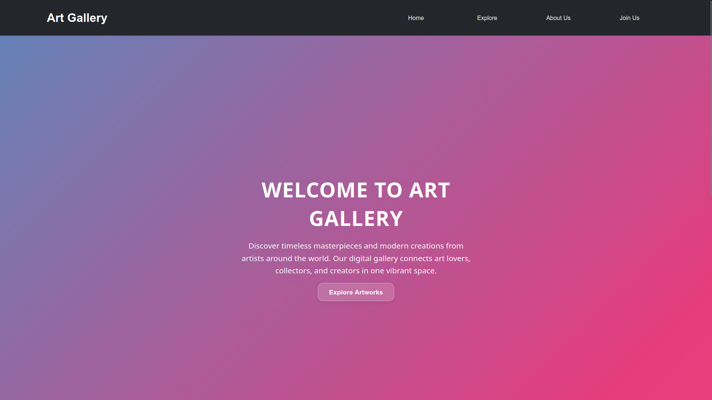
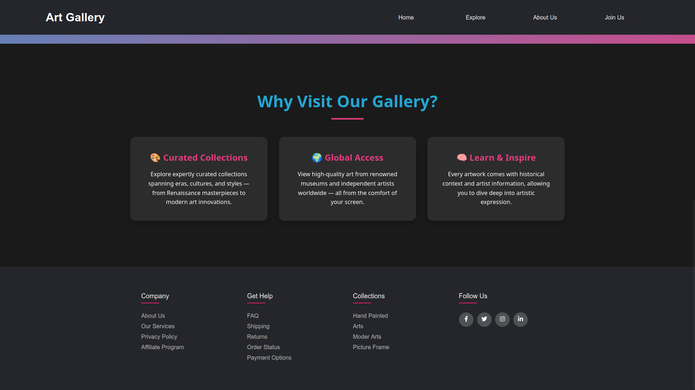
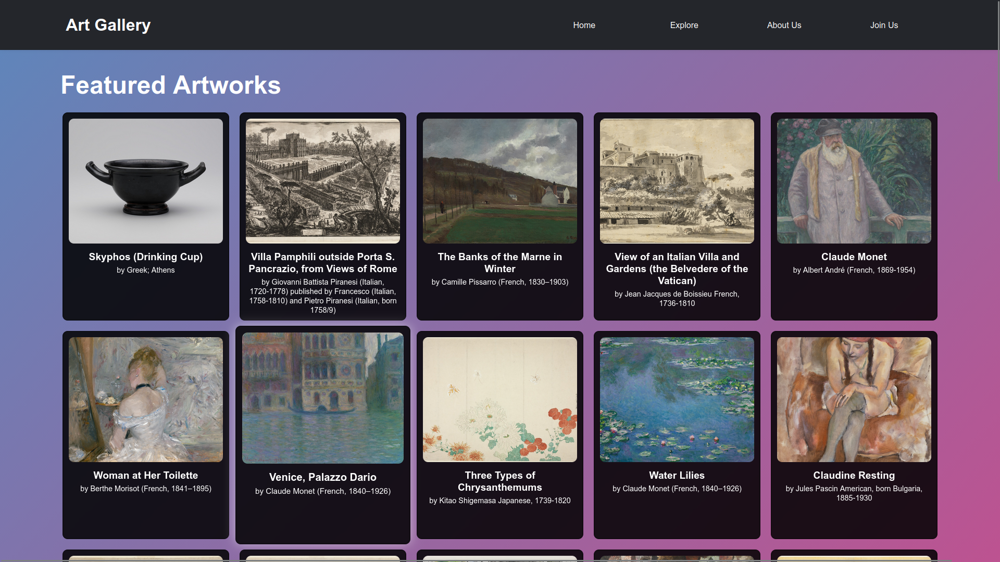
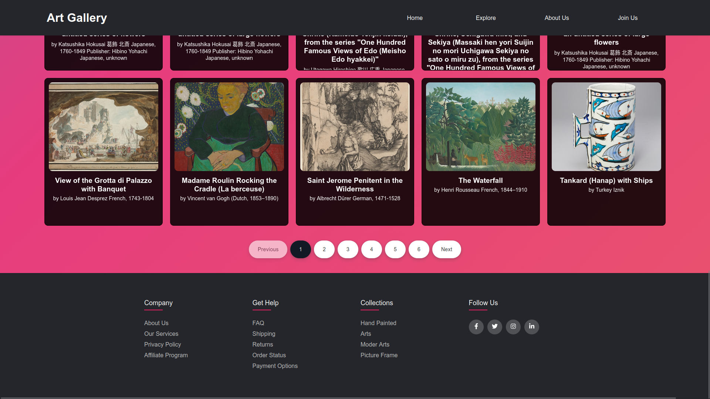
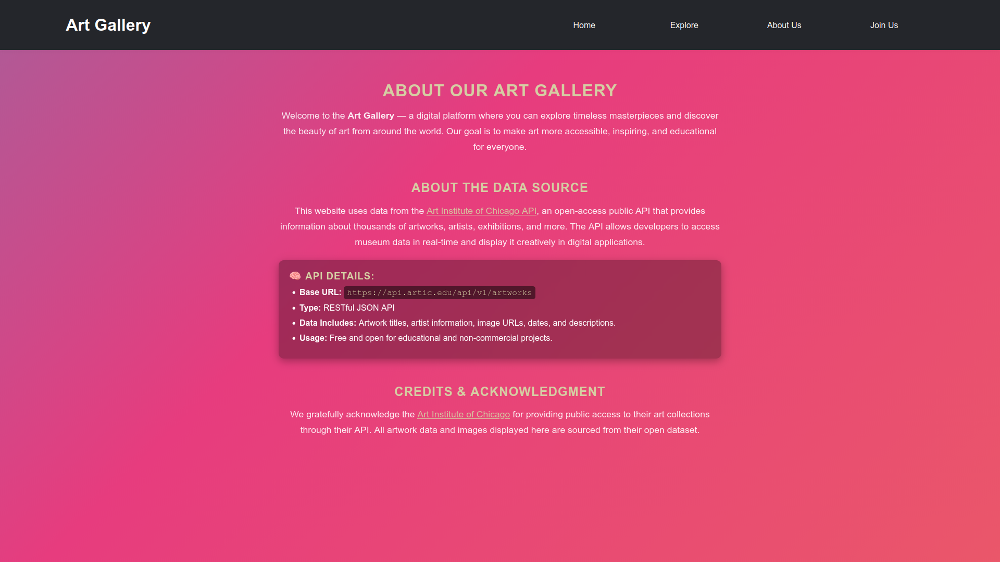
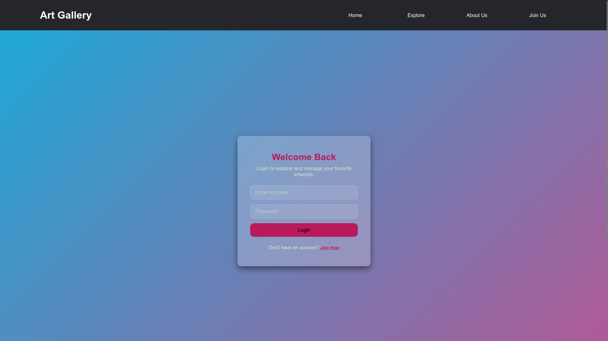
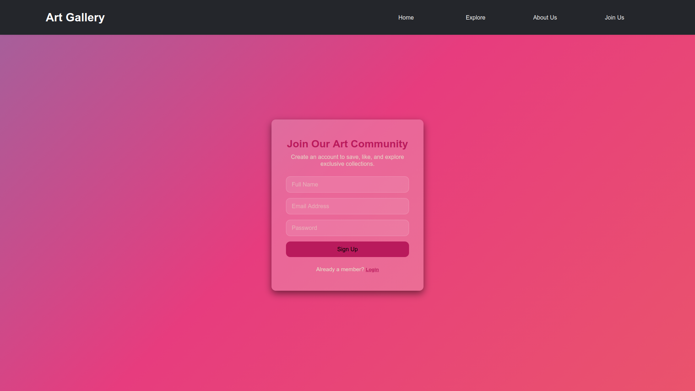

# Art Gallery Explorer

A React and SCSS single-page experience that showcases curated artwork from the Art Institute of Chicago API 

##Coded by [React](https://react.dev/) and styled with [SCSS](https://sass-lang.com/).

 
### Core Technologies
- **HTML5**: The foundation of the project, ensuring semantic and accessible markup.
- **SCSS (Sass)**: Enhances CSS with variables, nesting, mixins, and more for cleaner and more manageable stylesheets.
- **CSS3**: Leveraged for styling, with SCSS for enhanced organization and maintainability.

##Screenshots





    
  

## Features
- **Immersive Hero**: Highlights the gallery vision with quick navigation into the collection.
- **Live Collections**: Fetches real-time artwork data, renders responsive cards, and supports pagination.
- **Educational Context**: Surfaces artist details and museum credits to add historical depth.
- **Community Onboarding**: Offers a join flow that toggles between login and sign-up states.
- **AI-Assisted Enhancements**: Utilizes AI guidance to polish component structure and styling decisions.

### UI/UX
- **Responsive Design**: The project is optimized to work seamlessly across all screen sizes, ensuring an excellent user experience on both desktop and mobile devices.
- **Interactive Elements**: Smooth animations and engaging user interactions that enhance the overall experience.

## Tech Stack
- **JS Library**: React 19 with Vite bundling.
- **Routing**: `react-router-dom` for multi-page flows.
- **Styling**: Global SCSS with component-level partials.
- **Icons**: `react-icons` for social and navigation glyphs.
- **Data Source**: Art Institute of Chicago open API.

## Getting Started
1. `npm install`
2. `npm run dev`
3. Visit `http://localhost:5173`

## Available Scripts
- **Development**: `npm run dev`
- **Build**: `npm run build`
- **Preview**: `npm run preview`
- **Lint**: `npm run lint`

## Project Structure
```text
src/
├─ assets/
├─ components/
│  ├─ artworksList/
│  ├─ footer/
│  ├─ loading/
│  ├─ navbar/
│  └─ pagination/
├─ pages/
│  ├─ aboutUs/
│  ├─ explore/
│  ├─ homePage/
│  └─ joinUs/
├─ index.scss
└─ main.jsx
```

## Core Pages & Components
- **HomePage**: Introduces the gallery mission and feature highlights.
- **Explore**: Renders the paginated artwork catalogue via `ArtworksList`.
- **AboutUs**: Credits the Art Institute of Chicago and documents API usage.
- **JoinUs**: Provides interactive login and registration toggling.
- **NavBar & Footer**: Delivers persistent navigation and social links.

## Deployment
- **Static Build**: Run `npm run build` to generate production assets inside `dist/`.
- **Preview**: Use `npm run preview` to validate the bundle locally before hosting.

## License
- **Usage**: Built for educational and portfolio demonstrations; respect API terms from the Art Institute of Chicago.


## Contact

For any questions, feedback, or contributions, please reach out via:

- **Email**: [aswinvishal402@gmail.com](mailto:aswinvishal402@gmail.com.com)
- **GitHub**: [aswin402](https://github.com/aswin402)